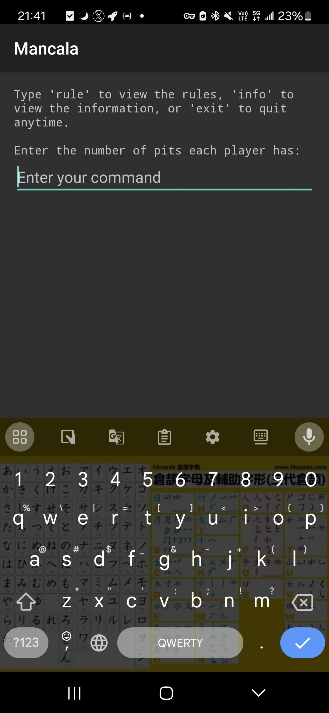
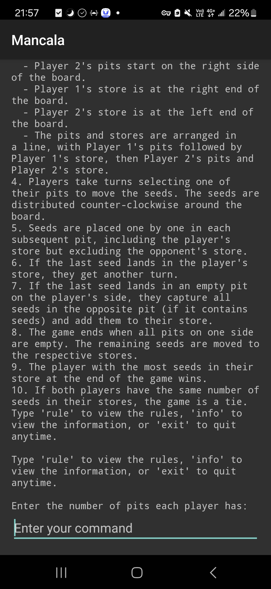
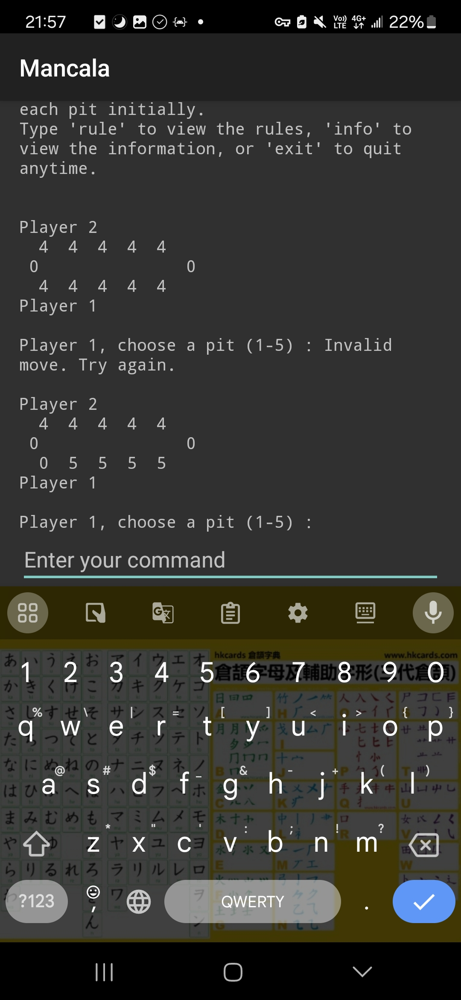

# mancala-android
Mancala is a traditional board game that involves strategy, counting, and some luck. This implementation of Mancala is developed for Android, allowing players to enjoy the game on their mobile devices.
## Installation
<!--  -->

## App Screenshots

## Requirements
Minimum Android version: API 21 (Android 5.0, Lollipop)
## Mancala Rules
1. The board has two rows of pits, one for each player. Each player has a row of pits and a store.
2. Each player has a certain number of pits (defined at the beginning of the game) and each pit starts with the same number of seeds (also defined at the beginning).
3. The board setup is as follows:
  - Player 1's pits start on the left side of the board.
  - Player 2's pits start on the right side of the board.
  - Player 1's store is at the right end of the board.
  - Player 2's store is at the left end of the board.
  - The pits and stores are arranged in a line, with Player 1's pits followed by Player 1's store, then Player 2's pits and Player 2's store.
4. Players take turns selecting one of their pits to move the seeds. The seeds are distributed counter-clockwise around the board.
5. Seeds are placed one by one in each subsequent pit, including the player's store but excluding the opponent's store.
6. If the last seed lands in the player's store, they get another turn.
7. If the last seed lands in an empty pit on the player's side, they capture all seeds in the opposite pit (if it contains seeds) and add them to their store.
8. The game ends when all pits on one side are empty. The remaining seeds are moved to the respective stores.
9. The player with the most seeds in their store at the end of the game wins.
10. If both players have the same number of seeds in their stores, the game is a tie.
## Credits
### AndroidIDE by AndroidIDE / AndroidIDEOfficial
- GitHub: [https://github.com/AndroidIDEOfficial/AndroidIDE](https://github.com/AndroidIDEOfficial/AndroidIDE).
- F-Droid: [https://f-droid.org/packages/com.itsaky.androidide/](https://f-droid.org/packages/com.itsaky.androidide/).
### ChatGPT by OpenAI
- Official website: [https://chatgpt.com/](https://chatgpt.com/).
## Contribution
We welcome contributions to this project! Please fork the repository and submit a pull request for your contributions. For clarity and convenience, we recommend making one pull request per revised section or added feature.
## License
Copyright (C) 2024 [Willie169](https://github.com/Willie169).\
This project is licensed under the terms of the **GNU AFFERO GENERAL PUBLIC LICENSE**, Version 3.0.\
You should have received a copy of the GNU Affero General Public License along with this software. If not, see [https://www.gnu.org/licenses/agpl-3.0.html](https://www.gnu.org/licenses/agpl-3.0.html).